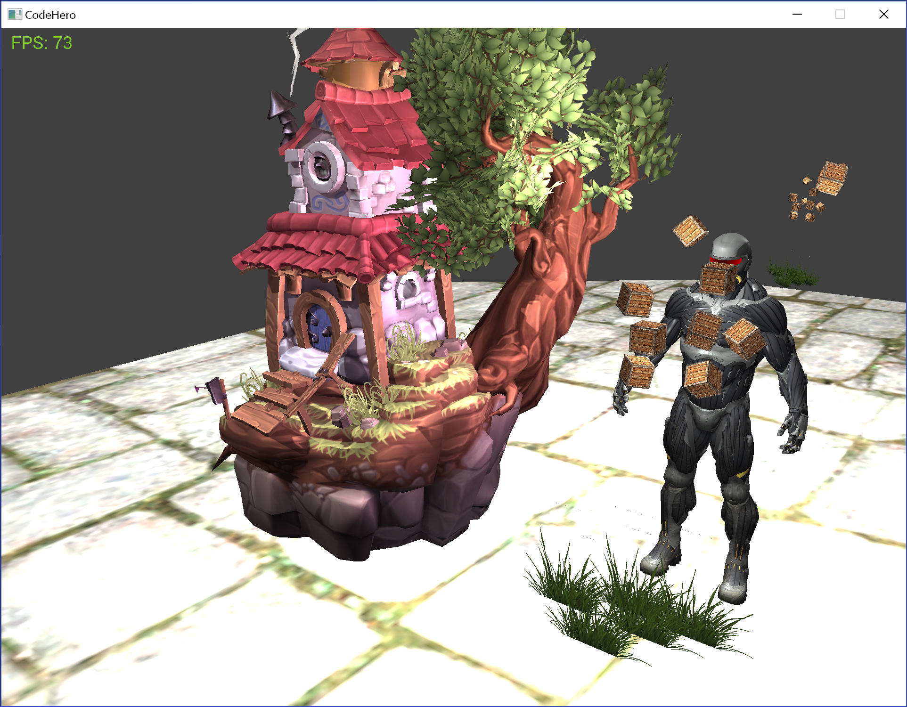

# CodeHero  

**This is heavily in development. This is not a complete project - which means that many things will be reworked, the code is experimental for the most part and is subject to rework. Documentation will be added.**

**_Moreover, this is a learning project as well and might contains not accurate and/or optimal things. Feel free to create an issue if you detect one or to contribute_**

Many things that are developped in this project could be using libraries, but there is a choice not
to do so:
  * As part of the learning, looking at the lower level API help understand the mechanism
  * Better control over things
  * Fun !

### Global

* Use Left-handed coordinate system
* Use degrees for angles
* Using OpenGL 3.3+

### Features (to be completed of course)
* Skybox

### Working on...
* Adding slowly a full scene system (and serialization over XML/JSON)
* Basic animation system
* UI for Editor + In-Game: The idea is devided in two
  * Editor: Less performing containing very complete widget and SVG based for high quality editor
  * In-Game: Based on Sprites to compose your own UI (Low/High DPI capable) - more performing.

### Very high level roadmap
* Continue to push support for modern OpenGL
* More effect (Fog, Toon shading, PBR, ...)
* Integrate a physics engine
* Add support for Audio
* Particle system
* Add networking
* Scripting (Lua ? JS ? C# ?)
* Editor
* More tooling
* Add support for modern D3D12
* Add support for Vulkan
* Support for VR ? Using MiddleVR ?
* Documentation: How to compile, how to create project, how to contribute, general architecture, ...
* Better window/input management. Probably moving from GLFW to in-house drivers.

### Compilation

[See here](./docs/compilation.md)

### Credits

* Special thanks to Joey for his awesome tutorials on OpenGL that made me even more motivated to start that project: [learnopengl.com](https://learnopengl.com)
* (Model) Small House Diorama by glenatron is licensed under CC Attribution-NonCommercial.
* (Model) Treasure Chest by Demeter Dzadik is licensed under CC BY 4.0.
* To all the Open Source Game Engine that I enjoyed in the past browsing the source code and learn from and that made me even more eager to continue ! (Ogre, Irrlicht, Torque3D, Urho3D, Godot, UnrealEngine, CryEngine, ...)

### Screenshots

